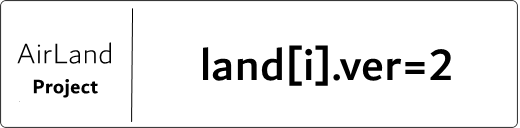

# 🗺️ AirLand 官方站

欢迎！这里是iLand插件的文档站兼官方网站，iLand是一个支持BDS（Mojang提供的官方基岩版服务端），基于LiteXLoader插件平台的全功能领地插件。

### 🎯 Specials in *iLand*
 

✔️ | 领地配置全GUI操作 | ✔️ | 50+项领地权限控制 | ✔️ | 高效率区块算法
:-:|:-:|:-:|:-:|:-:|:-:
✔️ | 插件设定全GUI操作 | ✔️ | 完整的国际化语言包系统 | ✔️ | 全面易用的ILAPI
✔️ | 提供其他领地数据转换工具 | ✔️ | 圈地粒子特效 | ✔️ | LandSign
✔️ | 多经济前置 | ✔️ | 木斧圈地工具 | ✔️ | 通过配置文件高自定义

### 🧭 Compass

[安装指南]()

### 👩‍💻 Feedback
 

Github Issue | [#1](https://github.com/LiteLDev-LXL/iLand-Core/issues/1)
-|-
QQ群 | [168611598](https://jq.qq.com/?_wv=1027&k=EKSQnno0)
Discord | [Join it.](https://discord.gg/fEdM9eRhkH)

### ❤️ Contributers
 

 | 
:-:|:-:
[@RedbeanW](https://github.com/Redbeanw44602) | [@gxh](https://github.com/littlegao233)

---
*Welcome to use iLand v2 ~* 
