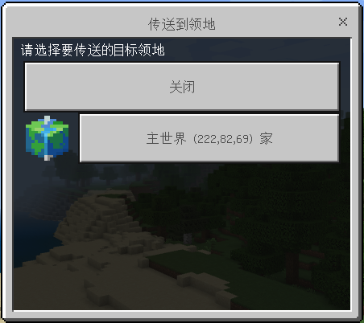

# LandTp

### 呼出
 - `/land tp` 所有玩家可用
 - `/land tp set` *设置传送点* 所有玩家可用

### 领地传送

在此界面选择要传送到的领地，信任玩家的领地也在列表内。

### 安全传送

由于直接传送经常有卡墙窒息这种尴尬情况，故加入了安全传送，大致逻辑如下

?> A. 先将玩家传送到目标点`y`轴为`500`处。 
    B. 循环检测玩家`y`轴是否开始变动，若开始变动说明区块加载完成 
    C. 遍历`y`轴寻找落脚点（落脚点指非岩浆和空气方块，且上一个方块也是如此的方块的坐标） 
    D. 将玩家传送到距离目标点最近的落脚点 