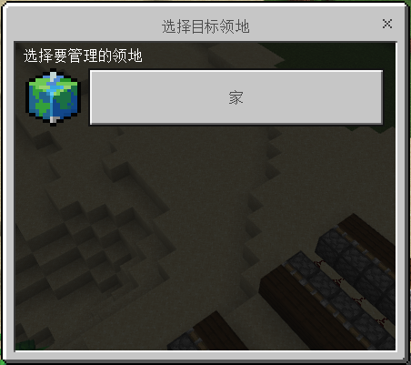
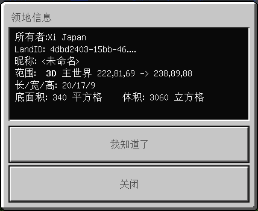
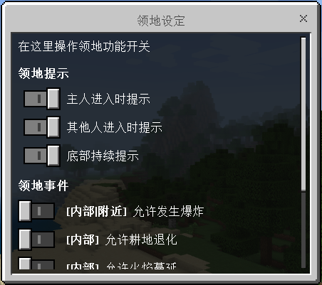
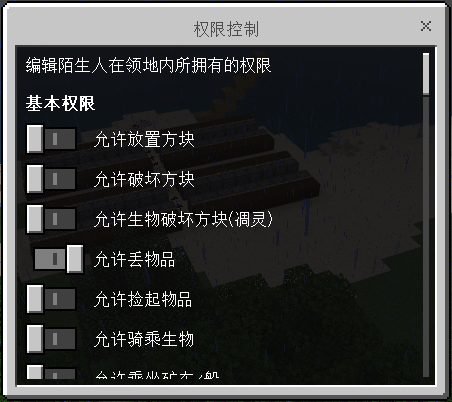
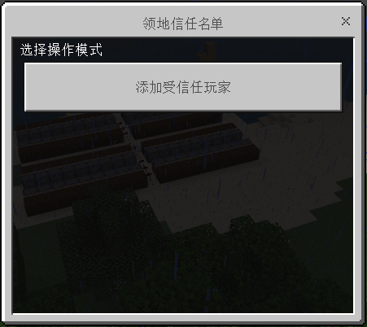
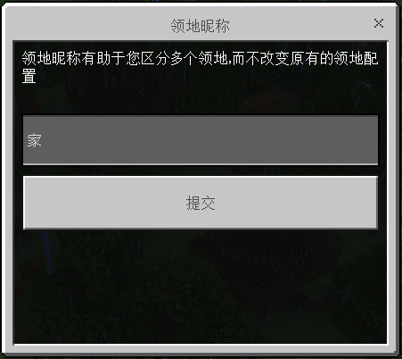
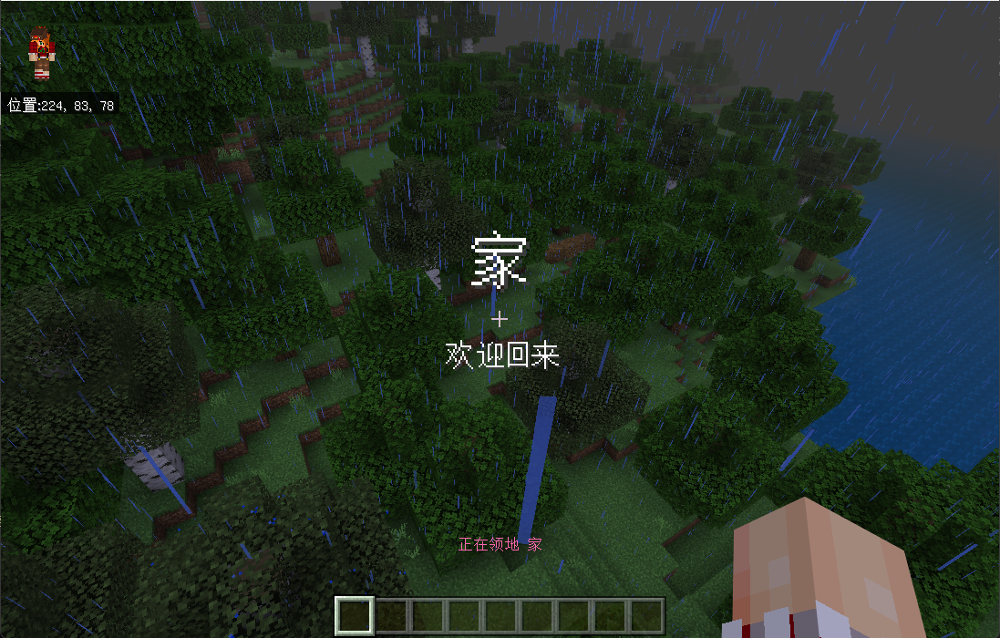
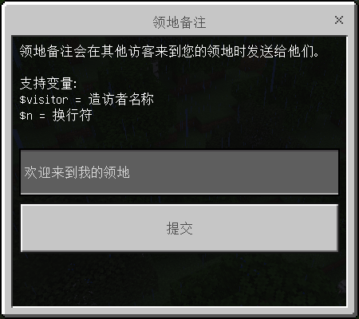
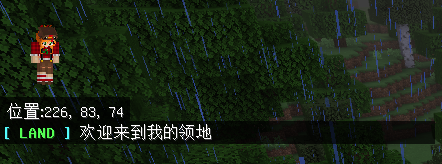

# LandManager

### 呼出
 - `/land` 所有玩家可用
 - `/land gui` 所有玩家可用

### 领地选择器

在领地内使用`/land gui`（或在领地外使用`/land`）后选择管理领地可以调出此界面。

### 领地管理器

在领地内使用`/land`可直接出现此界面，或在领地外使用`/land gui`后选择领地也可出现此界面。

### 领地信息查看

在这个页面，你可以很方便的查到领地的一些信息。

### 领地配置项

在这个界面，你可以调整领地提示功能，并控制部分领地内或领地附近发生的事件。

### 权限配置

在这个界面，你可以设置许多陌生人在领地内可以进行与不可以进行的行为。

### 领地信任

在这个界面可以设置当前领地信任的玩家，被信任的玩家拥有领地的部分权限。

如果一个玩家被设定为信任玩家，那么Ta对于信任Ta的领地：

所有陌生人权限控制 | 使用领地传送 | 编辑领地权限设置 | 信任其他人 | 删除/重圈领地 | 领地管理器
-|-|-|-|-|-
不生效 | ✔️ | ❌ | ❌ | ❌ | 不会出现新的领地

### 领地昵称

在这个界面可以设定自己领地的昵称，因为`ID`难以记忆，不能很好的帮助玩家区分多个领地。

对于设置了昵称的领地，领地提示有这样的效果：

### 领地备注

在这个界面可与设置领地备注，这些信息将在陌生玩家进入领地时被发送。

如果没有设置备注，就不会有信息发送。若备注已经设置，大概有这样的效果：

支持变量 | Replace
-|-
$visitor | 访客ID
$n | 换行符

### 重选领地范围

此选项可以进入圈地模式，重新选择当前领地的维数（`2D`、`3D`）和范围，选择过程与圈地过程完全一样，选择完成后使用`/land ok`确认，将根据原范围价值和现范围价值做公平的费用收取或退款。

### 领地过户

选择一个玩家作为当前领地的主人，过户完成后领地相关配置不会有变动，同时您不具有此领地任何权限，除非新主人再次授予你。

### 删除领地

删除领地并退款，领地保护将立即失效，并且领地相关数据立即删除，无法恢复。