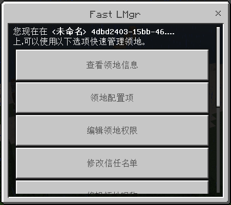

# LandManager

### 呼出
 - `/land gui` 所有玩家可用
 - `/land` 所有玩家可用

### 快捷领地管理器
> 不同于经典领地管理器，新加入的快捷领地管理器使用按钮格式，在领地上使用`land`即可打开，仅能操作当前领地。

### 领地信任

> 设置领地信任将授予您信任的玩家部分权限，方便好友共享领地。 

> 如果一个玩家被设定为信任玩家，那么Ta对于信任Ta的领地：

破坏/放置/使用/... | 使用领地传送 | 编辑领地权限设置 | 信任其他人 | 删除领地 | LandMgr
-|-|-|-|-|-
✔️ | ✔️ | ❌ | ❌ | ❌ | 不会出现新的领地

### 领地权限控制
> iLand配置权限非常方便，请看图 👇 

> 权限配置是针对陌生人的，如果某项被关闭，陌生人在您的领地内执行对应项操作时将被拦截。

### 领地昵称
> 领地昵称是帮助你区分多个领地的，`1.1.0`之后，它与`LandID`脱离关系并加入配置文件。 
> 设置领地昵称是很有必要的，领地昵称会在许多地方代替landId达到赏心悦目的效果。 

### 领地备注
> 领地备注是针对访客而言的（访客暂时包括已信任成员），备注会在访客进入领地时发送给他们。 
> 值得注意的是，领地备注属于领地Sign，若您在`config.json`中关闭了`LandSign`，领地备注将无效。 

支持变量 | Replace
-|-
$visitor | 访客ID
$n | 换行符
> 例如，如此设定了领地Describe

### 过户与删除
> 得益于ILand的数据结构设计，领地可以完美过户（不会丢失任何领地配置）。过户完成后，领地所有者将改变，此改动实时生效。 
> 删除领地会得到退款（默认情况下），领地删除后所有领地配置**立刻删除，无法恢复**。