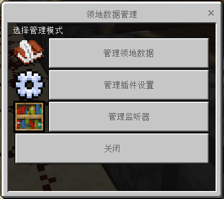

# OPLManager

### 呼出
 - `/land mgr` 领地管理员可用

### 功能

在这里可以快捷的通过GUI管理服务器的所有领地、插件配置和监听器。



> 管理领地比较简单，下面主要介绍各个插件配置如何正确调整。<br>
> 监听器管理请右转[传送门](listenerMgr.md)

#### 插件设定

这里主要调整插件自身的一些行为。

##### 允许插件联网

?> config.json: `this.plugin.network`

是否允许插件联网，禁用后无法使用检查更新、自动更新、语言包更新、语言包下载、在线公告等功能。

##### 插件语言

?> config.json: `this.plugin.language`

插件使用的语言包，位于`plugins/iland/lang`，可以使用指令下载。

#### 领地设定

这里主要调整领地管理的相关参数。

##### 单玩家最多拥有领地数

?> config.json: `this.land.max_lands`

一个玩家最多可以圈的领地数量，不包括被信任领地。

##### 开启二维圈地

?> config.json: `this.land.bought.two_dimension.enable`

是否允许平面圈地。

##### 开启二维圈地

?> config.json: `this.land.bought.three_dimension.enable`

是否允许立体圈地。

!> 价格计算中算式的书写请看本页末。

##### 领地最小面积

?> config.json: `this.land.bought.bought.square_range.(*)1`

单领地最小面积，不建议小于`4`。

##### 领地最大面积

?> config.json: `this.land.bought.bought.square_range.(*)2`

单领地最大面积，推荐`50000`。

##### 领地与领地间最小距离

?> config.json: `this.land.min_space`

领地间距，不建议小于`5`，否则可能给一些附近控制项造成影响。

##### 折扣（%）

?> config.json: `this.land.discount`

购买领地时打折，例如`70%`为七折，`100%`无折扣。

##### 退款率（%）

?> config.json: `this.land.refund_rate`

退款时计算领地价值后乘此值，领地价值已包含折扣。

##### 在主世界/地狱/末地圈地

?> config.json: `this.features.selection.dimension.(*)1-3`

#### 经济设定

这里主要是领地购买/退款时用到的经济套件设置。

##### 经济套件

?> config.json: `this.economic.protocol`

可选计分板经济或LLMoney，推荐后者。

##### 计分板名称

?> config.json: `this.economic.scoreboard_objname`

如果选择LLMoney作为经济套件，此项无效。

##### 货币名称

?> config.json: `this.economic.currency_name`

#### LandSign

领地提示功能相关设置

##### 领地进入提示

?> config.json: `this.features.landsign.enable`

在玩家进入领地时，显示`Title`提示。

##### 底部持续提示

?> config.json: `this.features.buttomsign.enable`

玩家在领地内时，在底部持续显示在何领地内。

!> 提示频率单位为秒，即每隔几秒检测一遍玩家是否在领地内，以判断是否要发提示。

#### 粒子效果

圈地粒子效果相关设置

##### 圈地粒子效果

?> config.json: `this.features.particles.enable`

在圈地完成时显示粒子效果以展示圈地的范围。

##### 粒子名称

?> config.json: `this.features.particles.name`

粒子名称，更多粒子可以在[这里](https://minecraft.fandom.com/zh/wiki/%E7%B2%92%E5%AD%90)找到。

##### 粒子最大数量

?> config.json: `this.features.particles.max_amount`

过多的粒子可能导致客户端卡死，推荐值`600`。

#### 玩家选择器

玩家选择器相关设定

##### 包含离线玩家

?> config.json: `this.features.player_selector.include_offline_players`

是否包含记录到的所有玩家，关闭则只包含在线的玩家。

##### 单页显示玩家数目

?> config.json: `this.features.player_selector.items_perpage`

每页显示多少玩家，建议值`20`。

#### 其他功能

##### 领地传送

?> config.json: `this.features.landtp`

是否全局关闭领地传送功能，纯生存服务器可能需要。

##### 强制对话替代Actionbar

?> config.json: `this.features.force_talk`

如果有别的插件占用了`Actionbar`，请开启此项。

##### 区块边长

?> config.json: `this.features.chunk_side`

区块算法构建表时单区块的边长，值越小查询越快（不建议小于`4`），内存占用越大。

### Calculate 算式使用方法

 - 变量

Name | 含义
-|-
`{height}`  |   框选高度
`{length}`  |   框选长度
`{width}`   |   框选宽度
`{square}`  |   框选底面积（相当于长度乘宽度）
`{volume}`  |   框选体积（相当于底面积乘高度）

 - 运算符

Symbol | 含义
-|-
`+`   |   加法
`-`   |   减法
`*`   |   乘法
`/`   |   除法
`%`   |   取余
`^`   |   乘幂

 - 几个示例

```
// 底面积每格20金币，高度每增加1收50金币。
{square}*20+{height}*50
// 底面积每格30金币
{square}*30
// 体积，每块10金币
{volume}*10
 ```
